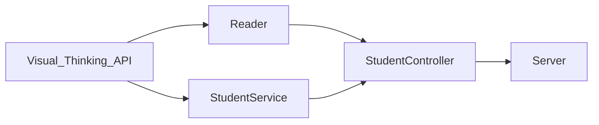

# Visual-Thinking-API
Code Challenge : Visual Thinking API

Para utilizar el proyecto es necesario contar con algunas dependencias que se instalan desde la línea de comandos en la raíz del proyecto:

- **NPM**: Utiliza el comando *npm -init*
- **Jest** : El proyecto incluye pruebas de unidad realizadas con Jest para verificar el funcionamiento de los métodos que son utilizados en las clases y evitar errores en el funcionamiento, para instalarlo utiliza el comando *npm install jest@26.0.0 --save*
- **Linter** : Aplicar guías de estilo al código fuente, para ello utiliza *npm install eslint --save-dev* y para generar el archivo ( ya está incluido en el repositorio ) *npm init @eslint/config*
- **Express** : Es utilizado para la creación y funcionamiento de la API, utiliza *npm install express --save*

## Componentes

## API

- **¿Cómo consultarla?**  
Utilizando localhost en el puerto 3000, como se muestra a continuación, la información devuelta estará en formato JSON

- **Ver lista de Estudiantes**  
Utilizando el parámetro */students* después de localhost

- **Ver correo electrónico de estudiantes con certificación**  
Utilizando el parámetro */students/mail* después de localhost

- **Ver créditos de estudiantes con puntaje mayor a 500**  
Utilizando el parámetro */students/credits* después de localhost

   

